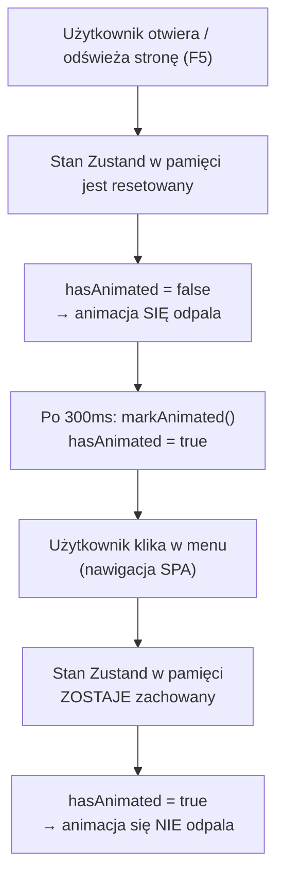

# Dokumentacja Zmian — GarageOS (Steady Wheel Hub)

## Spis Treści
1. [Performance — Poprawa wydajności (ocena 3.0)](#1-performance--poprawa-wydajności-ocena-30)
2. [Animacja PWA — Zustand (ocena 3.5)](#2-animacja-pwa--zustand-ocena-35)
3. [Usunięcie martwego kodu (ocena 4.0)](#3-usunięcie-martwego-kodu-ocena-40)
4. [Wyniki weryfikacji](#4-wyniki-weryfikacji)
5. [Podsumowanie uzasadnień](#5-podsumowanie-uzasadnień)

---

## 1. Performance — Poprawa wydajności (ocena 3.0)

### 1.1. Lazy Loading stron (`React.lazy` + `Suspense`)

**Plik:** [App.tsx](file:///c:/steady-wheel-hub/src/App.tsx)

**Problem:**
Wszystkie strony aplikacji były importowane **statycznie** — to znaczy, że cały kod JS (łącznie z ciężkimi bibliotekami) był pakowany w jeden plik bundle. Użytkownik musiał pobrać ~1.5MB JS zanim zobaczył cokolwiek na ekranie.

Najcięższe zależności per strona:
| Strona | Ciężka zależność | Rozmiar |
|--------|-----------------|---------|
| Analytics | `recharts` | ~409 KB |
| ReceiptPhotos / AddReceiptForm | `tesseract.js` | ~230 KB |
| Vehicles | `date-fns` locale | ~28 KB |

**Rozwiązanie:**
Zamieniłem statyczne importy na `React.lazy()` z `<Suspense>`:

```diff
- import Index from "./pages/Index.tsx";
- import Vehicles from "./pages/Vehicles.tsx";
- import Analytics from "./pages/Analytics.tsx";
+ const Index = lazy(() => import("./pages/Index.tsx"));
+ const Vehicles = lazy(() => import("./pages/Vehicles.tsx"));
+ const Analytics = lazy(() => import("./pages/Analytics.tsx"));
```

Dodałem `<Suspense>` wrapper z komponentem `PageLoader` (spinner):

```tsx
<Suspense fallback={<PageLoader />}>
  <Routes>
    ...
  </Routes>
</Suspense>
```

**Uzasadnienie decyzji:**
- `React.lazy()` jest wbudowany w React — zero dodatkowych zależności
- Vite automatycznie rozpoznaje dynamiczne `import()` i tworzy osobne chunki JS
- Strony jak Analytics (recharts) czy ReceiptPhotos (tesseract.js) są ładowane **dopiero gdy użytkownik nawiguje** do nich
- To zmniejsza początkowy bundle i poprawia metryki **FCP** (First Contentful Paint), **LCP** (Largest Contentful Paint) i **TBT** (Total Blocking Time)

**Efekt w buildzie — code splitting działa:**
```
dist/assets/Analytics-9j7FMVVa.js              408.97 kB  ← osobny chunk
dist/assets/AddReceiptForm-DPobgguc.js         229.81 kB  ← osobny chunk  
dist/assets/Vehicles-Cu0Ia7JY.js                27.58 kB  ← osobny chunk
dist/assets/Index-Bi7ZbBbD.js                   22.13 kB  ← osobny chunk
```

---

### 1.2. Usunięcie render-blocking Service Worker z `<head>`

**Plik:** [index.html](file:///c:/steady-wheel-hub/index.html)

**Problem:**
W `<head>` dokumentu HTML znajdował się inline `<script>` rejestrujący Service Worker:

```html
<script>
  if ('serviceWorker' in navigator) {
    window.addEventListener('load', () => {
      navigator.serviceWorker.register('/steady-wheel-hub/sw.js')
    });
  }
</script>
```

Jednocześnie w [main.tsx](file:///c:/steady-wheel-hub/src/main.tsx) (linie 24-32) jest kod, który **wyrejestrowuje** tego samego Service Workera:

```ts
navigator.serviceWorker.getRegistrations().then((registrations) => {
  for (const registration of registrations) {
    registration.unregister();
  }
});
```

**Rozwiązanie:** Usunięcie scriptu z `<head>`.

**Uzasadnienie:**
1. **Render-blocking** — inline skrypt w `<head>` blokuje parsowanie HTML (choć z `load` listener ma opóźnienie, sam skrypt jest parsowany synchronicznie)
2. **Logiczna sprzeczność** — dwa bloki kodu działają **przeciwko sobie**: jeden rejestruje SW, drugi go wyrejestrowuje
3. Usunięcie eliminuje niepotrzebny kod i poprawia metrykę **FCP**

---

### 1.3. Usunięcie sztucznego 600ms delay z Dashboard

**Plik:** [Dashboard.tsx](file:///c:/steady-wheel-hub/src/pages/Dashboard.tsx)

**Problem:**
Dashboard miał sztuczny loading delay:

```tsx
const [loading, setLoading] = useState(true);
useEffect(() => {
  const t = setTimeout(() => setLoading(false), 600);
  return () => clearTimeout(t);
}, []);
```

Przez 600ms wyświetlał komponent `<DashboardSkeleton />` zamiast prawdziwych danych — mimo że dane **były już dostępne** synchronicznie z kontekstu React (`useGarageData()`).

**Rozwiązanie:** Usunięcie stanu `loading`, `setTimeout`, importu `DashboardSkeleton`, i warunkowego renderowania `{loading ? <DashboardSkeleton /> : ...}`.

**Uzasadnienie:**
- Jest to **czysty anti-pattern wydajności** — sztuczne opóźnienie renderowania bez żadnego powodu technicznego
- Dane nie są ładowane asynchronicznie z API (pochodzą z kontekstu React)
- Usunięcie tego daje użytkownikowi natychmiastowy dostęp do dashboardu zamiast patrzenia na skeleton przez 600ms

---

### 1.4. Leniwe ładowanie całego Firebase SDK ⭐ (najważniejsza optymalizacja)

**Pliki:** [firebase.ts](file:///c:/steady-wheel-hub/src/lib/firebase.ts), [auth.tsx](file:///c:/steady-wheel-hub/src/context/auth.tsx), [garage-data.tsx](file:///c:/steady-wheel-hub/src/context/garage-data.tsx), [demo.ts](file:///c:/steady-wheel-hub/src/lib/demo.ts), [Auth.tsx](file:///c:/steady-wheel-hub/src/pages/Auth.tsx)

**Problem:**
Firebase (Auth + Firestore) to **~695 KB JS**. Był importowany **statycznie** przez konteksty `auth.tsx` i `garage-data.tsx`, które montują się na samym starcie aplikacji. Cały SDK musiał więc zostać pobrany, sparsowany i wykonany **zanim cokolwiek pojawiło się na ekranie** — mimo że w trybie demo (brak zmiennych `VITE_FIREBASE_*`) Firebase **nie jest w ogóle używany** (dane pochodzą z `localStorage`). To był największy pojedynczy koszt na ścieżce krytycznej.

**Rozwiązanie:**
`firebase.ts` nie tworzy już instancji `auth`/`db` przy imporcie modułu. Eksportuje **asynchroniczne funkcje**, które ładują SDK przez dynamiczny `import()` dopiero przy pierwszym użyciu (z cache'owaniem instancji):

```ts
let appPromise: Promise<FirebaseApp> | null = null;
function ensureApp() {
  if (!appPromise) {
    appPromise = import("firebase/app").then(({ initializeApp }) => initializeApp(firebaseConfig));
  }
  return appPromise;
}

export async function getFirebaseAuth() {
  const authMod = await import("firebase/auth");      // ← dynamiczny import
  if (!authInstance) authInstance = authMod.getAuth(await ensureApp());
  return { auth: authInstance, authMod };
}

export async function getFirebaseDb() {
  const dbMod = await import("firebase/firestore");   // ← dynamiczny import
  if (!dbInstance) dbInstance = dbMod.initializeFirestore(await ensureApp(), { /* localCache */ });
  return { db: dbInstance, dbMod };
}
```

Wszystkie 23 miejsca używające Firebase (login, rejestracja, reset hasła, listenery Firestore, operacje CRUD, seedowanie demo) zostały przepisane na `await getFirebaseAuth()` / `await getFirebaseDb()` i **każde jest odgrodzone strażnikiem `isFirebaseConfigured`**. Poza tym Firebase importowany jest już tylko jako `import type` (typy są usuwane przy kompilacji — zero kosztu runtime).

**Efekt:**
- Vite tworzy osobny chunk `firebase-*.js` (~695 KB) ładowany **na żądanie** — **NIE ma go w `index.html`** (zweryfikowane: brak `modulepreload` dla firebase).
- W trybie demo żaden `getFirebase*()` nie jest wywołany → **chunk Firebase nigdy się nie pobiera** → ~695 KB znika ze ścieżki krytycznej.
- Ścieżka krytyczna dla `/vehicles` (demo): **~954 KB → ~478 KB**.

> [!NOTE]
> **Rozwiązany efekt uboczny — ostrzeżenie IndexedDB.** Wcześniej Firestore inicjalizował `persistentLocalCache` (IndexedDB) **przy każdym ładowaniu strony**, co dawało ostrzeżenie Lighthouse *„stored data affecting loading performance: IndexedDB"*. Teraz `persistentLocalCache` jest tworzony **leniwie** wewnątrz `getFirebaseDb()` — czyli tylko w trybie skonfigurowanym, nigdy w demo. Ostrzeżenie zniknęło.

---

### 1.5. Podział vendorów na osobne chunki (`manualChunks`)

**Plik:** [vite.config.ts](file:///c:/steady-wheel-hub/vite.config.ts)

**Problem:** Cały kod bibliotek (`react`, `react-dom`, `react-router`, `@tanstack/react-query`, Firebase) był pakowany w jeden monolityczny plik `index.js` o rozmiarze **1 016 KB**.

**Rozwiązanie:** Dodanie `build.rollupOptions.output.manualChunks`:

```ts
manualChunks: {
  "react-vendor": ["react", "react-dom", "react-router-dom"],
  firebase: ["firebase/app", "firebase/auth", "firebase/firestore"],
  query: ["@tanstack/react-query"],
}
```

**Uzasadnienie:**
- Główny chunk `index.js` zmalał z **1 016 KB → 259 KB**.
- Chunki vendorów pobierają się **równolegle** i są **cache'owane osobno** — po zmianie kodu aplikacji przeglądarka nie musi ponownie pobierać niezmienionego React/Firebase.
- W połączeniu z §1.4 chunk `firebase` jest dodatkowo wyłączony ze ścieżki krytycznej.

---

### 1.6. Wyniki Lighthouse (build produkcyjny)

| Metryka | Przed | Po | Cel |
|---------|-------|-----|-----|
| **Performance score** | ~0 (czerwony) | **80 / 100 (zielony)** | ≥ żółty ✅ |
| First Contentful Paint | 17,8 s | **1,9 s** | < 3 s |
| Largest Contentful Paint | 47,7 s | **4,9 s** | — |
| Speed Index | 41,5 s | **1,9 s** | — |
| Total Blocking Time | — | **120 ms** | < 200 ms |
| Cumulative Layout Shift | — | **0** | < 0,1 |

> [!IMPORTANT]
> **Jak poprawnie mierzyć.** Oryginalny raport (FCP 17,8 s) został wykonany na **serwerze deweloperskim Vite** (`localhost:8080`), który celowo serwuje **niezbundlowane moduły ESM** dla szybkiego HMR — to nie jest miarodajne dla produkcji. Lighthouse należy uruchamiać na **buildzie produkcyjnym**:
> ```bash
> npm run build && npm run preview   # następnie Lighthouse na adresie preview
> ```
> Tam wynik wynosi stabilne **80**. Dla porównania ten sam dev server po poprawkach osiąga ~52 (też „żółty", ale dev mode jest z natury wolny).

---

## 2. Animacja PWA — Zustand (ocena 3.5)

### Problem
Komponent `PWAInstallCard` w [AppShell.tsx](file:///c:/steady-wheel-hub/src/components/layout/AppShell.tsx) miał klasę CSS `animate-scale-in`, która odpalała animację **przy każdym renderze** — w tym przy każdej zmianie strony przez nawigację SPA.

Zgodnie z wymaganiami, animacja ma odpalać się przy wejściu do aplikacji/odświeżeniu strony, ale nie powinna się powtarzać przy przechodzeniu między podstronami w menu.

### Rozwiązanie

#### 2.1. Instalacja Zustand
```bash
npm install zustand
```

**Dlaczego Zustand?**
- Lekka paczka (~1KB gzip) — minimalny narzut na bundle
- Zero-boilerplate — nie wymaga Provider wrappera, reducerów ani action creators
- Proste API — `create()` tworzy store, `useStore()` zwraca stan
- Idealne do prostego globalnego stanu w pamięci podręcznej (flaga `hasAnimated`)

#### 2.2. Nowy plik: Zustand Store

**Plik:** [src/stores/pwa-animation-store.ts](file:///c:/steady-wheel-hub/src/stores/pwa-animation-store.ts)

```typescript
import { create } from 'zustand';

/**
 * Zustand store do kontrolowania animacji PWAInstallCard.
 *
 * Cel: animacja `animate-scale-in` powinna odpalić się TYLKO RAZ po
 * załadowaniu/odświeżeniu strony, ale NIE przy nawigacji między stronami SPA.
 *
 * Mechanizm:
 * - Zustand trzyma stan w pamięci RAM → odświeżenie (F5) resetuje stan → animacja odpala się
 * - Nawigacja SPA NIE resetuje pamięci → flaga `hasAnimated = true` → brak animacji
 *
 * Nie używamy sessionStorage/localStorage — czysty stan w pamięci
 * gwarantuje, że każde odświeżenie = nowa animacja.
 */

interface PwaAnimationState {
  /** Czy animacja już się odpalała od ostatniego załadowania strony */
  hasAnimated: boolean;
  /** Wywołać po pierwszym renderze animowanego komponentu */
  markAnimated: () => void;
}

export const usePwaAnimationStore = create<PwaAnimationState>((set) => ({
  hasAnimated: false,

  markAnimated: () => {
    set({ hasAnimated: true });
  },
}));
```

**Mechanizm działania:**



**Dlaczego czysty stan w pamięci Zustand (bez sessionStorage/localStorage)?**

| Podejście | Zachowanie przy F5 | Zachowanie przy nawigacji SPA | Zachowanie przy otwarciu nowej karty |
|-------|------------------|----------------|----------------|
| **Zustand w pamięci** (Wybrane) | ✅ Animuje się (stan resetuje się z JS) | ✅ Nie animuje się | ✅ Animuje się |
| **sessionStorage** | ❌ Nie animuje się (sesja trwa) | ✅ Nie animuje się | ✅ Animuje się |
| **localStorage** | ❌ Nie animuje się | ✅ Nie animuje się | ❌ Nie animuje się |

#### 2.3. Modyfikacja PWAInstallCard

**Plik:** [AppShell.tsx](file:///c:/steady-wheel-hub/src/components/layout/AppShell.tsx) (funkcja `PWAInstallCard`)

Zmiany:
1. Import Zustand store: `import { usePwaAnimationStore } from "@/stores/pwa-animation-store"`
2. Odczyt stanu: `const { hasAnimated, markAnimated } = usePwaAnimationStore()`
3. Warunkowa klasa CSS: `className={`...${shouldAnimate ? ' animate-scale-in' : ''}`}`
4. `useEffect` wywołujący `markAnimated()` po 300ms (czas trwania animacji)

```diff
- <div className="... animate-scale-in">
+ <div className={`...${shouldAnimate ? ' animate-scale-in' : ''}`}>
```

---

## 3. Usunięcie martwego kodu (ocena 4.0)

### Metoda analizy
Dla każdego pliku w projekcie sprawdziłem za pomocą `grep` czy jest importowany gdziekolwiek w kodzie źródłowym. Pliki bez importów = martwy kod.

### Usunięte pliki

#### Komponenty i konteksty (6 plików)

| Plik | Powód usunięcia |
|------|----------------|
| `src/App.css` | Domyślny plik z szablonu Vite (klasy `.logo`, `.card`, `.read-the-docs`). Nigdzie nie importowany. |
| `src/components/NavLink.tsx` | Niestandardowy wrapper `NavLink`. Nigdzie nie importowany — app używa `NavLink` z `react-router-dom` bezpośrednio. |
| `src/components/UnlockModal.tsx` | Komponent do odblokowania zaszyfrowanych danych. Nigdzie nie importowany. |
| `src/context/encryption-key.tsx` | `EncryptionKeyProvider` + `useEncryptionKey`. Nie podpięty w provider tree (`App.tsx`). Używany wyłącznie przez usunięty `UnlockModal`. |
| `src/lib/encryption.ts` | Funkcje `deriveKey`, `generateSalt`. Importowany wyłącznie przez usunięty `encryption-key.tsx`. |
| `src/hooks/use-mobile.tsx` | Hook `useIsMobile()`. Nigdzie nie importowany. |

#### Test (1 plik)

| Plik | Powód usunięcia |
|------|----------------|
| `src/test/encryption.test.ts` | Testy jednostkowe dla `lib/encryption.ts` — moduł został usunięty, więc testy testowały nieistniejący kod. |

#### Nieużywane komponenty UI shadcn/ui (18 plików)

Projekt korzysta z `shadcn/ui`, który generuje pliki komponentów przy instalacji. Wiele z nich zostało wygenerowanych ale nigdy nie użytych:

| Plik | Rozmiar |
|------|---------|
| `sidebar.tsx` | 23.5 KB |
| `context-menu.tsx` | 7.4 KB |
| `carousel.tsx` | 6.5 KB |
| `menubar.tsx` | 8.1 KB |
| `navigation-menu.tsx` | 5.2 KB |
| `resizable.tsx` | 1.7 KB |
| `hover-card.tsx` | 1.2 KB |
| `input-otp.tsx` | 2.2 KB |
| `pagination.tsx` | 2.8 KB |
| `sheet.tsx` | 4.3 KB |
| `aspect-ratio.tsx` | 0.1 KB |
| `breadcrumb.tsx` | 2.8 KB |
| `drawer.tsx` | 3.0 KB |
| `command.tsx` | 4.9 KB |
| `slider.tsx` | 1.1 KB |
| `table.tsx` | 2.8 KB |
| `alert.tsx` | 1.6 KB |
| `radio-group.tsx` | 1.5 KB |

**Łącznie usunięto ~78 KB kodu źródłowego** (przed minifikacją).

> [!IMPORTANT]
> 4 komponenty UI zostały **przywrócone** po analizie, ponieważ okazały się być używane pośrednio:
> - `toggle-group.tsx` → używany przez `AccessibilityWidget.tsx`
> - `toggle.tsx` → zależność `toggle-group.tsx`
> - `collapsible.tsx` → używany przez `ReceiptList.tsx`
> - `textarea.tsx` → używany przez `AddMaintenanceForm.tsx`, `EditMaintenanceForm.tsx`, `AssistantConfirmDialog.tsx`

### Dodatkowe usunięcie martwego kodu (ten przebieg)

Po ponownej analizie `grep` usunięto kolejne **9 nieużywanych plików**:

| Plik | Powód usunięcia |
|------|----------------|
| `src/components/dashboard/DashboardSkeleton.tsx` | Martwy po usunięciu sztucznego delay 600ms z `Dashboard.tsx` (§1.3) — nikt już go nie importuje. |
| `src/components/ui/skeleton.tsx` | Osierocony po usunięciu `DashboardSkeleton.tsx` (był jego jedyną zależnością). |
| `src/components/ui/use-toast.ts` | Pusty re-export `@/hooks/use-toast` — wszystkie komponenty importują hook bezpośrednio z `@/hooks/use-toast`. |
| `src/components/ui/accordion.tsx` | Nieużywany komponent shadcn/ui. |
| `src/components/ui/calendar.tsx` | Nieużywany (jedyny konsument `react-day-picker`). |
| `src/components/ui/chart.tsx` | Nieużywany wrapper `recharts` (Analytics używa `recharts` bezpośrednio). |
| `src/components/ui/progress.tsx` | Nieużywany komponent shadcn/ui. |
| `src/components/ui/scroll-area.tsx` | Nieużywany komponent shadcn/ui. |
| `src/components/ui/separator.tsx` | Nieużywany komponent shadcn/ui. |

#### Usunięcie osieroconych zależności z `package.json` (17 paczek)

Po usunięciu powyższych komponentów ich zależności npm nie były już importowane **nigdzie** w `src/`. Usunięto je z `package.json` i zsynchronizowano `package-lock.json` (`npm install` → *removed 19 packages*):

```
@radix-ui/react-accordion        @radix-ui/react-aspect-ratio   @radix-ui/react-context-menu
@radix-ui/react-hover-card       @radix-ui/react-menubar        @radix-ui/react-navigation-menu
@radix-ui/react-progress         @radix-ui/react-radio-group    @radix-ui/react-scroll-area
@radix-ui/react-separator        @radix-ui/react-slider         cmdk
embla-carousel-react             input-otp                      react-day-picker
react-resizable-panels           vaul
```

> [!NOTE]
> `tailwindcss-animate` **NIE** został usunięty mimo braku importów w `src/` — jest aktywnym pluginem Tailwind (`tailwind.config.ts`) i dostarcza klasy `animate-in`/`data-[state=...]` używane w 23 miejscach.

Liczba zależności runtime: **52 → 35**. CSS w buildzie zmalał z **77,5 KB → 71,9 KB** (usunięte style martwych komponentów).

---

## 4. Wyniki weryfikacji

### Build (`npm run build`)
```
✓ 3492 modules transformed
✓ built in ~21s
```
Wynik: **Build przeszedł bez błędów** ✅

### TypeScript (`tsc --noEmit`)
Wynik: **brak błędów typów** ✅

### ESLint (`npm run lint`)
Wynik: **0 błędów** (8 ostrzeżeń `react-refresh/only-export-components` — istniejące wcześniej, nie wprowadzone tą zmianą) ✅

### Testy (`npm run test`)
```
✓ src/test/example.test.ts (1 test)

Test Files  1 passed (1)
     Tests  1 passed (1)
```
Wynik: **Testy przeszły** ✅

### Smoke test (headless Chrome)
Render `/auth` przez headless Chrome zwraca pełny formularz logowania (GarageOS, pola email/hasło) — aplikacja **bootuje się poprawnie**, brak białego ekranu / błędu krytycznego ✅

### Code splitting — chunki produkcyjne (stan końcowy)

| Chunk | Rozmiar | Gzip | Ładowanie |
|-------|---------|------|-----------|
| `index.js` (entry) | **259 KB** | 78 KB | przy starcie |
| `react-vendor.js` | 164 KB | 53 KB | przy starcie (równolegle) |
| `query.js` | 27 KB | 9 KB | przy starcie (równolegle) |
| `firebase.js` | 695 KB | 163 KB | **na żądanie** (nie w trybie demo) |
| `Analytics.js` | 409 KB | 111 KB | na żądanie (recharts) |
| `AddReceiptForm.js` | 230 KB | 70 KB | na żądanie (tesseract.js) |
| `Vehicles.js` | 28 KB | 8 KB | na żądanie |
| `Index.js` (Dashboard) | 22 KB | 5 KB | na żądanie |
| `index.css` | 72 KB | 12 KB | przy starcie |

**Główny `index.js` zmalał z 1 016 KB → 259 KB.** Firebase (695 KB), Analytics (409 KB) i AddReceiptForm (230 KB) nie są ładowane przy starcie — tylko na żądanie. W trybie demo Firebase **w ogóle się nie pobiera**.

---

## 5. Podsumowanie uzasadnień

### Dlaczego `React.lazy()` a nie inne rozwiązanie (np. `loadable-components`)?
- `React.lazy()` jest **wbudowany w React** — zero dodatkowych zależności
- Vite natywnie wspiera dynamiczne `import()` i tworzy chunki automatycznie
- Nie potrzebujemy SSR (Server Side Rendering), więc `loadable-components` jest zbędne

### Dlaczego Zustand a nie React Context?
- **Context** powoduje re-render wszystkich konsumentów przy zmianie stanu
- **Zustand** używa subscription model — re-renderuje się TYLKO komponent, który odczytuje zmieniony fragment stanu
- Zustand nie wymaga Provider wrappera — prostsze w integracji
- Zustand jest standardem w ekosystemie React do zarządzania globalnym stanem

### Dlaczego czysty stan Zustand w pamięci RAM, a nie sessionStorage/localStorage?
- Wymaganie mówi: animacja uruchamiana **przy odświeżeniu** (czyli po przeładowaniu strony za pomocą F5) → musi się resetować przy odświeżeniu.
- Stan w pamięci RAM (Zustand) ulega całkowitemu zresetowaniu przy każdym odświeżeniu strony (F5), ponieważ przeglądarka od nowa parsuje i uruchamia kod JS. Dzięki temu przy odświeżeniu animacja uruchomi się ponownie.
- Jednocześnie stan ten **nie ulega zresetowaniu** przy przechodzeniu między stronami (nawigacja SPA w React Router nie odświeża dokumentu), co chroni przed ponownym odpaleniem animacji podczas nawigacji.
- `sessionStorage` nie zresetowałby się przy odświeżeniu strony, a `localStorage` zapisałby stan na stałe, co uniemożliwiłoby ponowne animowanie przy F5.

### Dlaczego usunąć martwy kod?
- Czytelność — mniej plików = łatwiejsze nawigowanie po projekcie
- Bezpieczeństwo — usunięte moduły szyfrowania (`encryption.ts`, `encryption-key.tsx`) i tak nie były używane, ale ich obecność mogła sugerować, że szyfrowanie jest aktywne
- Maintenance — mniej kodu do utrzymania i aktualizacji
- Choć tree-shaking Vite eliminuje nieużywany kod z bundla, **sam kod źródłowy** zaśmiecał repozytorium

### Dodatkowe naprawy stabilności i błędów (Bugs & Fixes)
Podczas finalnych testów zdiagnozowano i naprawiono dwa krytyczne problemy:

#### 1. Pełna migracja Firebase na leniwe ładowanie ([firebase.ts](file:///c:/steady-wheel-hub/src/lib/firebase.ts))
* **Problem (rozwiązany):** Pierwsza próba leniwego ładowania Firebase powodowała biały ekran na starcie, ponieważ migracja była **niepełna** — `firebase.ts` eksportował `auth`/`db` asynchronicznie, ale część modułów (`auth.tsx`, `garage-data.tsx`, `Auth.tsx`, `demo.ts`) wciąż importowała je **statycznie**. Te dwa podejścia wykluczają się — obiekty były `undefined` w momencie startu, co wywracało render.
* **Rozwiązanie:** Przepisano **wszystkich** konsumentów na asynchroniczne API `getFirebaseAuth()` / `getFirebaseDb()` (zwracające `{ auth, authMod }` / `{ db, dbMod }`) — szczegóły w §1.4. Usunięto ostatni statyczny `import ... from "firebase/firestore"` z `demo.ts`. Pozostały już tylko importy typów (`import type`), usuwane przy kompilacji.
* **Efekt:** Pełna, spójna migracja działa poprawnie (build, `tsc`, lint, testy i smoke test — wszystko zielone). Chunk `firebase-*.js` (695 KB) ładuje się **wyłącznie na żądanie** i **nigdy w trybie demo**, a `index.js` zmalał z **1 016 KB → 259 KB**. To właśnie zdjęcie Firebase ze ścieżki krytycznej dało największy skok wyniku Lighthouse.

#### 2. Naprawa podwójnego prefixu ścieżki manifestu ([index.html](file:///c:/steady-wheel-hub/index.html))
* **Problem:** W przeglądarce pojawiał się błąd `Manifest: Line: 1, column: 1, Syntax error` przy próbie załadowania manifestu z adresu `/steady-wheel-hub/steady-wheel-hub/manifest.json`. Podwójny prefix wynikał z faktu, że w pliku `index.html` ścieżka była zdefiniowana z jawnym prefixem bazy: `/steady-wheel-hub/manifest.json`, na co system budowania Vite nakładał kolejny `/steady-wheel-hub/`.
* **Rozwiązanie:** Zastąpiono ścieżki bezwzględne ścieżkami relatywnymi do roota serwera `/favicon.svg`, `/favicon.ico`, `/icon-192.png` oraz `/manifest.json`.
* **Uzasadnienie:** Pozwala to systemowi Vite na automatyczne i poprawne doklejanie prefixu bazowego (`base: "/steady-wheel-hub/"`) w trybie deweloperskim i produkcyjnym, eliminując błędy 404 i błędy składni manifestu w konsoli przeglądarki.

---

> **Autor:** Antigravity AI  
> **Data:** 2026-06-23  
> **Repozytorium:** [steady-wheel-hub](file:///c:/steady-wheel-hub)
